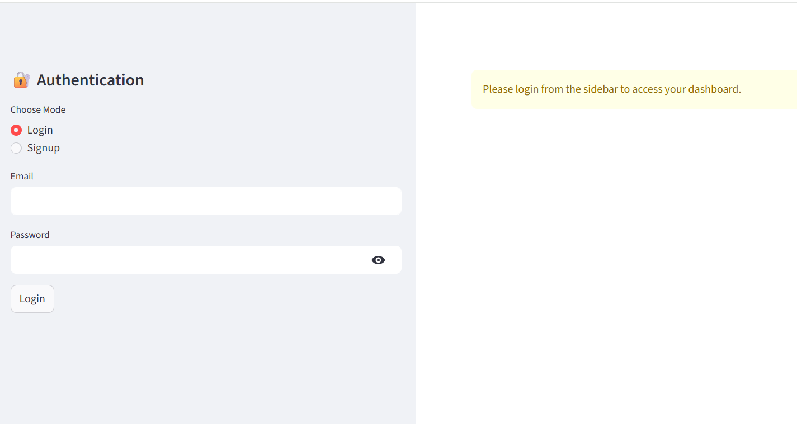
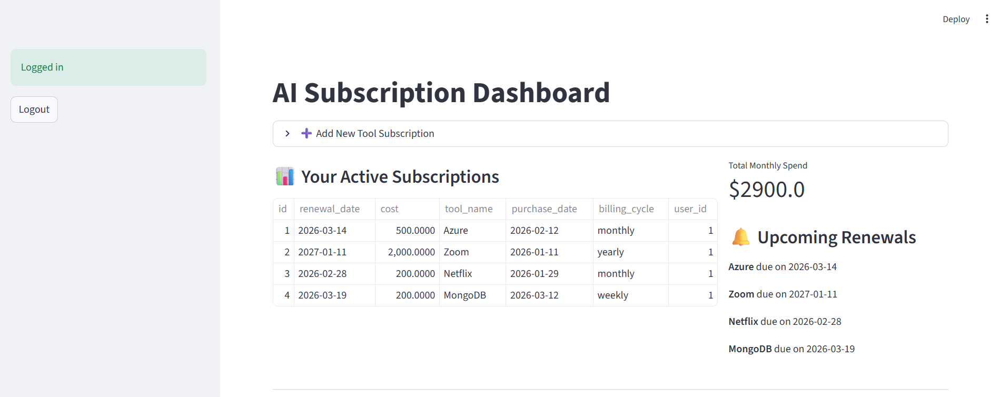
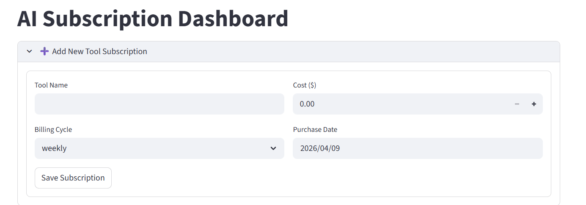
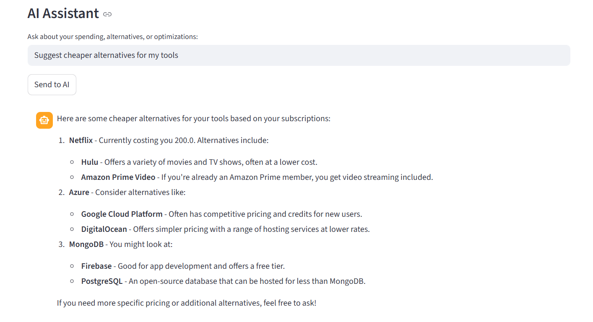

#  AI-Powered Subscription Manager

An intelligent full-stack application designed to help users **track, manage, and optimize software subscriptions**.
It integrates an **AI-powered assistant** to provide insights, suggest cost optimizations, and send **automated renewal alerts** — ensuring you never miss a payment.

##  Key Features

###  Intelligent AI Assistant

* Chat-based assistant that understands your subscription data
* Suggests **cheaper alternatives** using real-time web search
* Provides **spending analysis and optimization insights**

###  Proactive Renewal Alerts

* Automated email notifications before renewal dates
* Background scheduler ensures alerts are sent **on time (2 days prior)**

###  Secure Authentication

* OAuth2-based login system
* JWT (JSON Web Tokens) for secure sessions
* User-specific data isolation

###  Dynamic Dashboard

* Clean and interactive UI built with Streamlit
* View all subscriptions in one place
* Track total spending and upcoming renewals

###  Automated Subscription Logic

* Auto-calculates renewal dates based on:

  * Weekly
  * Monthly
  * Yearly billing cycles

##  Tech Stack

 Layer      Technology                   
 ---------  ---------------------------- 
 Backend    FastAPI (Python)             
 Frontend   Streamlit                    
 AI Layer   LangGraph, LangChain         
 LLM        GPT-4o-mini                  
 Database   SQLAlchemy (SQLite)          
 Scheduler  APScheduler                  
 Security   JWT (JOSE), Passlib (Bcrypt) 

### 1️ Prerequisites

Make sure you have:

* Python 3.10+
* OpenAI API Key
* Tavily API Key (for web search)
* Gmail App Password (for email alerts)

### 2️ Installation

## Clone the repository
git clone <your-repo-link>
cd AI_Subscription_Manager

## Install dependencies
pip install -r requirements.txt

If installing manually:
pip install fastapi uvicorn sqlalchemy passlib bcrypt python-jose
pip install langchain langgraph langchain-openai langchain-community
pip install streamlit requests python-dotenv apscheduler

### 3️ Environment Setup
Create a `.env` file in the root directory:

OPENAI_API_KEY=your_openai_key
TAVILY_API_KEY=your_tavily_key
EMAIL_USER=your_email@gmail.com
EMAIL_PASS=your_16_character_app_password

### 4️ Run the Application

####  Start Backend (FastAPI)

uvicorn main:app --reload

####  Start Frontend (Streamlit)

streamlit run app.py

##  API Documentation

Once the backend is running, open:

👉 http://127.0.0.1:8000/docs

### Available Endpoints:

* `POST /signup/` → Register new user
* `POST /login/` → Authenticate user
* `POST /subscriptions/` → Add subscription
* `GET /dashboard/` → View spending insights
* `POST /chat/` → Interact with AI assistant

##  AI Agent Workflow

The AI agent is built using **LangGraph StateGraph** and follows this flow:

1. **Retrieve**
   Fetch user subscription data from the database

2. **Search**
   Use Tavily API for real-time pricing & alternatives

3. **Analyze**
   Compare current subscriptions with market options

4. **Respond**
   Provide actionable insights to reduce spending

##  Example Use Cases

*  “How can I reduce my monthly subscription cost?”
*  “Suggest cheaper alternatives for my tools”
*  “Analyze my spending trends”

##  Future Improvements

*  Advanced analytics dashboard (charts & trends)
*  Customizable email alert preferences
*  Cloud deployment (AWS / Docker)
*  Mobile-friendly UI

##  Screenshots

###  Dashboard

###  Add Subscription

###  AI Assistant

